# NUR 144 — UNIT 1, LECTURE 1
## Gastric & Duodenal Disorders

**Sources:** Lecture 1-1 (GI Assessment), Lecture 1-2 (Gastric & Duodenal Disorders), Week One Addendum, and instructor speaker notes.

**Legend**
- ★ = professor flagged this on the slide ("MUST KNOW," "NEED TO KNOW," "will be on exam," "know the pic")
- ⊕ = filled in from the textbook because the slide listed the topic but gave no content
- ⊙ = textbook detail added where the slide named something without explaining it

Everything unmarked is straight slide content.

**Images** are extracted directly from the lecture PDFs and live in the `images/` folder next to this file. Keep them together or the diagrams won't render.

---

## OBJECTIVES

From the two Objectives slides and the closing "Review of Objectives" checklist:

1. Review anatomy and physiology of the GI system
2. Review anatomy and physiology of the upper GI tract
3. Discuss terms related to the GI system
4. Describe common assessments of the GI system
5. Discuss common laboratory tests and diagnostic tools for upper GI dysfunction
6. Consider the etiology and incidence of upper GI dysfunction
7. Describe common assessment findings with upper GI dysfunction
8. Describe select conditions of upper GI dysfunction
9. Explain appropriate nursing care and rationales for patients with upper GI dysfunction

---

## ANATOMY & PHYSIOLOGY

### GI tract overview

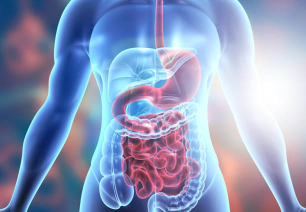

- Pathway 23–26 feet (7–7.9 m), mouth → esophagus → stomach → small intestine → large intestine → rectum → anus
- Esophagus and anus sit **outside** the peritoneum
- Blood supply = 20% of total cardiac output, and it **increases after eating**
- Small intestine is the **longest** segment — duodenum, jejunum, ileum

### Esophagus
- In the mediastinum
- **Anterior to the spine, posterior to the trachea** and heart
- Hollow muscular tube, about 10 inches
- Passes through the diaphragm at the **diaphragmatic hiatus** ← this opening is what enlarges in hiatal hernia

### Stomach
- In the peritoneum, **left upper quadrant**, under the left lobe of the liver and the diaphragm
- Capacity ≈ 1500 mL
- Stores food, secretes digestive fluids, propels partially digested food (**chyme**) into the small intestine
- **Inlet** = gastroesophageal junction · **Outlet** = pyloric sphincter

### Large intestine
- Ascending colon on the **right** → transverse colon crosses **right to left** across the upper abdomen → descending colon on the **left** → sigmoid, rectum, anus

### Sympathetic vs. parasympathetic ★
Both branches innervate the GI tract, and they do opposite things.

| | **Sympathetic** | **Parasympathetic** |
|---|---|---|
| Overall effect | **Inhibits** GI | **Stimulates** GI |
| Secretions | ↓ gastric secretions | ↑ secretion activity |
| Motility | ↓ motility | ↑ peristalsis |
| Sphincters | **Constrict** | **Relax** |
| Blood vessels | Constrict | — |

*Exception:* the upper esophageal sphincter and the external anal sphincter stay under **voluntary** control and don't relax with parasympathetic stimulation.

**Why:** sympathetic is "fight or flight" — blood is being shunted away from digestion toward muscle, so the gut shuts down. Parasympathetic is "rest and digest."

### Functions of the digestive tract

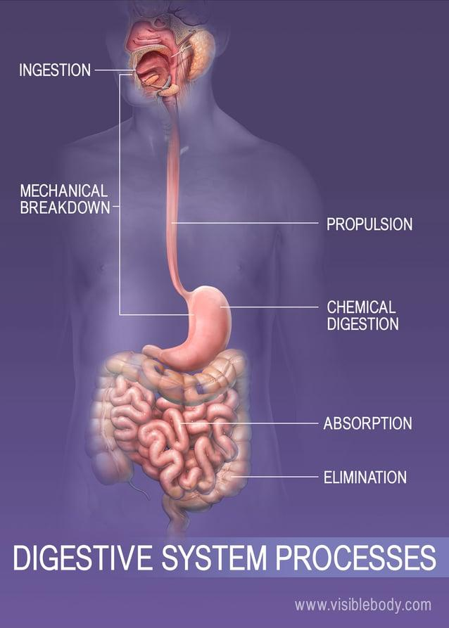

1. **Breakdown** of food for digestion
2. **Absorption** of small nutrient molecules into the bloodstream
3. **Elimination** of undigested, unabsorbed foodstuffs and waste

---

## TERMS ★ (NEED TO KNOW)

**The professor flagged the absorption vs. elimination distinction specifically as being on the exam.**

- **Ingestion** — food is taken into the GI tract via the mouth and esophagus
- **Digestion** — begins with **chewing**; food is broken into small particles that can be swallowed and mixed with digestive enzymes; proteins, fats, and sugars are broken into their component molecules
- **Absorption** — the **major function of the small intestine**. Small molecules, vitamins, and minerals pass through the intestinal wall into the circulation. Begins in the **jejunum**, by active transport and diffusion. Vitamins and minerals are absorbed essentially **unchanged**.
- **Elimination** — happens **after** digestion and absorption, when waste products leave the body

**The distinction in one line:** absorption = nutrients going **in** to the bloodstream. Elimination = waste going **out** of the body.

### Small intestine detail
- ~two-thirds of total GI length; ~230 feet of surface area for secretion and absorption
- Proximal → **duodenum** · middle → **jejunum** · distal → **ileum**
- Ileum terminates at the **ileocecal valve**, which controls flow into the cecum and **prevents reflux of bacteria back into the small intestine**
- Vermiform appendix attaches to the cecum — little or no physiologic function
- The **common bile duct** empties into the duodenum at the **ampulla of Vater**, delivering both bile and pancreatic secretions

---

## MAJOR ENZYMES & SECRETIONS

| Site | Secretion | Acts on |
|---|---|---|
| Mouth | Saliva (mechanical breakdown) | — |
| Mouth | **Salivary amylase** | Starch / sugar |
| Stomach | **Hydrochloric acid** | Creates acid environment |
| Stomach | **Pepsin** | Protein |
| Stomach | **Intrinsic factor** | Required for **vitamin B12 absorption** |
| Small intestine (via common bile duct) | **Amylase** | Starch / sugar |
| Small intestine | **Lipase** | **Fat** |
| Small intestine | **Trypsin** | **Protein** |
| Small intestine | **Bile** | Fat |

**Two high-yield traps:**
- **Lipase = fat, trypsin = protein.** The professor wrote a Knowledge Check on exactly this confusion.
- **Intrinsic factor is made by the parietal cells of the stomach.** No intrinsic factor → no B12 absorption → **pernicious anemia**. This is the link that explains why chronic gastritis causes anemia.

---

## ASSESSMENT OF THE GI SYSTEM ★ (MUST KNOW)

### Health history
Obtain information about: abdominal pain, dyspepsia, gas, nausea and vomiting, diarrhea, constipation, fecal incontinence, jaundice, and previous GI disease.

### Pain ★ (know the referred pain picture)
Assess **character, duration, pattern, frequency, location, distribution of referred pain, and timing** — all of these vary greatly depending on the underlying cause.

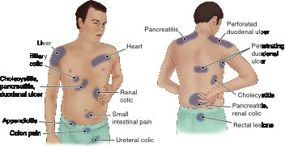

**Front of the body (anterior):**
- **Liver** — right upper, below the ribs
- **Biliary colic** — right upper, medial to the liver
- **Heart** — central/epigastric (this is why cardiac pain can be mistaken for indigestion)
- **Cholecystitis, pancreatitis, duodenal ulcer** — left of midline, upper
- **Renal colic** — mid-abdomen, lateral
- **Small intestinal pain** — periumbilical
- **Appendicitis** — right lower quadrant
- **Colon pain** — lower left
- **Ureteral colic** — lower, toward the groin

**Back of the body (posterior):**
- **Pancreatitis** — upper back, both sides of the spine
- **Perforated duodenal ulcer** — high, right shoulder/upper back
- **Penetrating duodenal ulcer** — mid-back, right of spine
- **Cholecystitis** — right mid-back
- **Pancreatitis, renal colic** — mid-back, left of spine
- **Rectal lesions** — sacral / low back

**The pattern worth internalizing:** duodenal ulcers refer to the **back**, and the difference between perforated and penetrating shows up as a difference in *height* on the back. Anything biliary or hepatic stays **right**; pancreatic pain crosses to **both sides** posteriorly.

### Dyspepsia (indigestion)
- **Most common symptom of patients with GI dysfunction**
- Upper abdominal discomfort **associated with eating**
- Pain, fullness, bloating, early satiety, belching, heartburn, regurgitation
- **Worse with** fatty foods, coarse vegetables, highly seasoned foods
- Affects about **25% of Americans** (instructor note)

### Intestinal gas
- Bloating, distention, feeling "full of gas"
- Belching and/or excessive flatulence
- Often a symptom of **food intolerance or gallbladder disease**

### Nausea and vomiting
- **Nausea** — vague, uncomfortable sensation of sickness or "queasiness," may or may not be followed by vomiting. Often occurs with distention of the duodenum or upper GI tract.
- **Vomiting (emesis)** — forceful emptying of stomach and intestinal contents through the mouth
- **Causes:** visceral pain, motion, anxiety, medication, torsion, trauma, metabolic abnormalities, toxins, chemotherapy, radiation, inner ear disorders, **anticipatory**
- *Anticipatory example (instructor note):* a chemo patient begins vomiting **before** the infusion starts

### Change in bowel habits and stool characteristics
May signal colonic dysfunction or disease. Constipation, diarrhea, plus:

| Stool finding | Suggests |
|---|---|
| Bulky, greasy, foamy, foul-smelling (may or may not float) | **Fat malabsorption** |
| **Light gray or clay colored** | **Absence of conjugated bilirubin** (biliary obstruction) |
| Mucus threads or pus visible | Inflammation / infection |
| Loose, watery (± blood streaks) | Diarrhea, possible bleeding |

**Non-pathologic color causes (instructor note) — don't mistake these for bleeding:**
- Green → leafy greens, spinach, kale
- Red → beets, red gelatin, tomato soup, food coloring
- Black → **bismuth, iron**, black licorice
- Milky white → **barium**

### Past health, family, and social history
Oral care and dental visits · lesions in the mouth · discomfort with certain foods · **alcohol and tobacco use** · dentures · previous diagnostic studies, treatments, or surgery · weight gain or loss · medications · dietary intake

---

## TYPES OF BLOOD (Addendum)

Single-concept definitions — these get tested as "what is the term for…"

| Term | Definition |
|---|---|
| **Occult** | Blood **not visible** to the naked eye |
| **Melena** | Dark, black, **tarry** stools |
| **Hematochezia** | Passage of **fresh blood** through the anus, in or with stool |
| **Rectorrhagia** | Rectal bleeding **not associated with defecation** |
| **Hematemesis** | **Vomiting** of blood |

**Why the color matters (instructor note):** bright red blood is coming from a source close to an opening — the esophagus or the rectum — because it hasn't been digested. Black/tarry means the blood traveled through and was digested, so the source is higher up.

---

## PHYSICAL ASSESSMENT OF THE GI SYSTEM

### Oral cavity
- **Lips** — color, hydration, texture, symmetry, ulcerations, fissures
- **Gums** — inflammation, bleeding, retraction, discoloration, odor
- **Tongue** — texture, color, lesions, symmetry
- **Normal findings:** a thin white coat and a large "V" on the distal tongue
- **Remove the patient's dentures** before inspecting (instructor note)
- Watch for viral and fungal infections, and cancers

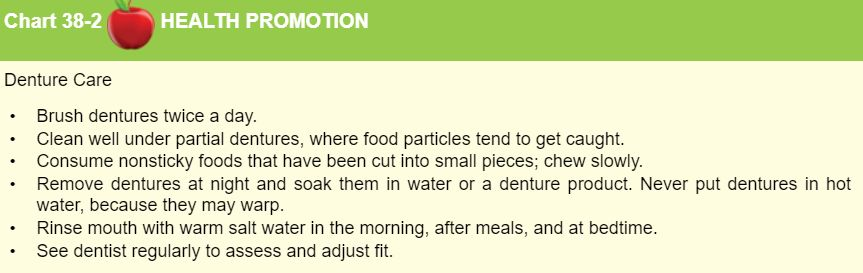

**Denture care (Health Promotion chart on the slide)**
- Brush dentures **twice a day**
- Clean well **under partial dentures**, where food particles get caught
- Consume **nonsticky** foods cut into small pieces; **chew slowly**
- **Remove dentures at night** and soak in water or a denture product — **never put dentures in hot water, they may warp**
- Rinse the mouth with **warm salt water** in the morning, after meals, and at bedtime
- See a dentist regularly to assess and adjust fit

### Abdominal assessment ★ (NEED TO KNOW)
- **Position:** dorsal recumbent
- **Order: Inspection → Auscultation → Percussion → Palpation**

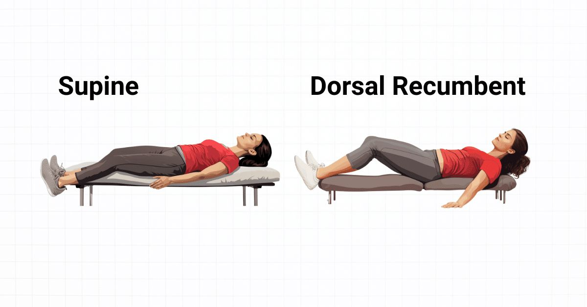

**Supine vs. dorsal recumbent** — the slide shows these side by side without explaining the difference. **Supine** is flat on the back with legs extended. **Dorsal recumbent** is on the back with the **knees flexed and feet flat**. Knees bent **relaxes the abdominal muscles**, which is why it's the position for abdominal assessment — a tensed abdominal wall makes palpation useless.

**Why the order:** auscultation must come **before** you manipulate the abdomen, because percussing and palpating change motility and will give you an inaccurate read on bowel sounds. This is the reverse of every other body system, which is why it's tested.

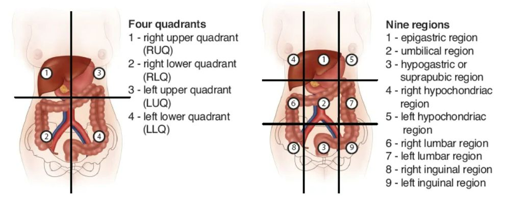

**Four quadrants:** RUQ, RLQ, LUQ, LLQ
**Nine regions:** 1 epigastric · 2 umbilical · 3 hypogastric (suprapubic) · 4 right hypochondriac · 5 left hypochondriac · 6 right lumbar · 7 left lumbar · 8 right inguinal · 9 left inguinal

### Rectal inspection
- Position **lithotomy or side-lying**
- Note abnormalities and hygiene

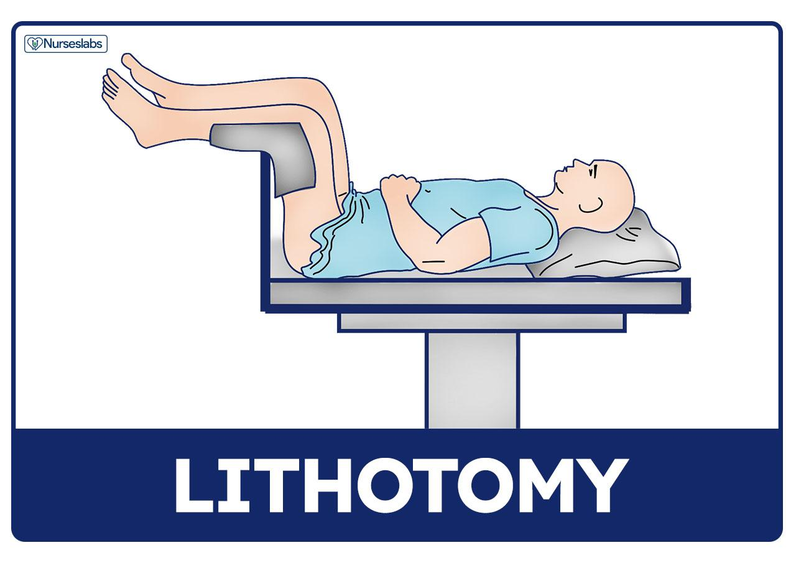
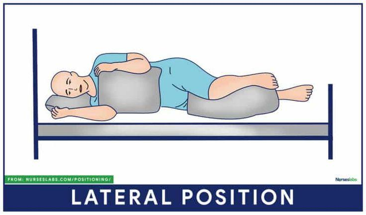

---

## LABORATORY & DIAGNOSTIC STUDIES

The slide lists these as names only. ⊕ marks what each one actually is and what the nurse does.

### Serum laboratory studies ⊕
CBC, complete metabolic panel, PT/PTT, triglycerides, liver function tests, **amylase and lipase** (pancreatic). Tumor markers when indicated: **CEA** (normally undetectable in blood — presence signals cancer, though not which type) and **CA 19-9** (shed by tumor cells, used to track the course of disease).

### Stool tests ⊕
Basic exam = consistency, color, **occult blood**. Further studies include fecal fat, C. difficile, fecal leukocytes, parasites, pathogens.

- **Collection:** random specimens go to the lab **promptly**; quantitative 24–72 hour collections must be **refrigerated** until transported.
- **gFOBT (guaiac fecal occult blood test)** — inexpensive, noninvasive. **Do not perform if there is hemorrhoidal bleeding.**
  - Avoid **red meat for 3 days** and **aspirin/NSAIDs for 7 days** → these cause **false positives**
  - Avoid **vitamin C for 3–7 days** → causes **false negatives**
- **FIT (fecal immunochemical test)** — uses antibodies to human hemoglobin. **No dietary or medication restrictions.** Done annually.
- **Stool DNA (FIT-DNA)** — detects abnormal DNA from cancer or polyp cells plus occult blood. No restrictions. Every 3 years.

### Breath tests ⊕
- **Urea breath test** → detects ***H. pylori***. Patient swallows carbon-labeled urea; a breath sample is taken 10–20 minutes later. H. pylori rapidly metabolizes urea, so labeled carbon shows up as CO₂ in the exhaled breath.
  - **Hold antibiotics and bismuth subsalicylate for 1 month** and **PPIs for 2 weeks** before the test — otherwise you suppress the organism and get a false negative
- **Hydrogen breath test** → evaluates carbohydrate absorption; diagnoses bacterial overgrowth and short-bowel syndrome

*Slide/addendum version of the procedure:* patient exhales into a balloon-like bag for a **baseline** sample, drinks a lemon-flavored solution, and gives a **second breath sample 15 minutes later**, which is tested for increased carbon dioxide.

### Abdominal ultrasonography ⊕
Noninvasive; high-frequency sound waves. **Advantages:** no ionizing radiation, no side effects, low cost, nearly immediate results. **Limitations:** patient body type, bowel gas patterns, operator experience.

### Genetic testing ⊕
Identifies risk for gastric cancer, lactose deficiency, inflammatory bowel disease, colon cancer. Patients identified as at-risk may pursue genetic counseling.

### Upper GI tract study (upper GI series / barium swallow) ⊕
Fluoroscopy after a contrast agent — usually **barium sulfate**. Detects ulcers, varices, tumors, regional enteritis, malabsorption. Visualizes esophageal position/patency/caliber, then stomach motility, gastric wall thickness, mucosal pattern, pyloric valve patency, duodenal anatomy. Images may be repeated for up to 24 hours to assess **gastric emptying rate**.

**Nursing:** low-residue or clear liquid diet, **NPO after midnight**. **No smoking and no gum chewing** during the NPO period — both increase gastric secretions and salivation.

*Instructor note:* after a barium swallow the patient should **drink a lot of water**, because they'll be dehydrated. There is also a barium study for the lower GI tract.

### GI motility studies ⊕
Radionuclide testing of gastric emptying and colonic transit. A tagged meal (typically scrambled eggs) is followed under a scintiscanner to measure the rate it leaves the stomach. **Useful for diagnosing gastric motility disorders, diabetic gastroparesis, and dumping syndrome.**

### Endoscopic procedures
- **Esophagogastroduodenoscopy (EGD)** and **gastroscopy** — direct visualization of the upper GI tract
- **Manometry** and electrophysiologic studies — measures pressure; catheter through the nose while the patient lies on their side, measuring **lower esophageal sphincter pressure** during swallowing
- **Ultrasound · CT · MRI**

---

## NURSING INTERVENTIONS FOR GI IMAGING STUDIES (Addendum)

This section is dense and highly testable — it's all nursing action.

- **NPO 8 hours before studies, or NPO after midnight**
- Position patients on their **LEFT side** for colonoscopy and endoscopy, to facilitate clearance of pulmonary secretions
- **Assess for allergies to dyes, contrast agents, and shellfish**
- **Remove all jewelry and metal before MRI**
- **After endoscopy — assess that the gag reflex has returned** before giving anything by mouth
- Provide **written** discharge instructions whenever sedation was involved (the patient won't retain verbal ones)
- The colon must be **empty** for colonoscopy → thorough bowel cleanse and prep required
- **Colonoscopy is contraindicated** with suspected or documented colon perforation, acute severe diverticulitis, or acute colitis
- Monitor for **abdominal pain, abdominal distention, rectal bleeding**
- **Educate** that some gas pain and flatulence is normal afterward, from air insufflated into the bowel during the procedure
- Remind patients that **cigarette smoking increases gastric secretions**

---

## DISORDERS OF THE ORAL CAVITY

### Periodontal disease
- Includes **gingivitis** — inflammation of the gums
- **Common cause of tooth loss**
- Common in people over 30; **smoking increases risk**

### Dental plaque and caries
- Tooth decay — an **erosive** process
- Caused by mouth bacteria producing an acidic environment that breaks down enamel
- **Prevention:** clean teeth several times a day (brushing and flossing), fluoride toothpaste, fluoridated community water

### Nursing implications
- **Poor oral intake reduces saliva production** → increased oral care is required
- **Soft bristle brush** is best; wipe with a **gauze pad** if the patient can't tolerate brushing
- Oral inflammatory disease is linked to **cardiovascular disease, diabetes, rheumatoid disease, premature birth, low birth weight, and stroke**
- Encourage adequate food intake · minimize mouth pain · support positive self-image

---

## DISORDERS OF THE ESOPHAGUS ★ (MUST KNOW THIS)

**Full list from the addendum:** motility disorders (achalasia, esophageal spasm) · hiatal hernias · diverticula · perforation · foreign bodies · chemical burns · GERD · Barrett esophagus · benign tumors · carcinoma

### Key symptom vocabulary
| Term | Meaning |
|---|---|
| **Dysphagia** | Difficulty swallowing |
| **Odynophagia** | **Painful** swallowing |
| **Pyrosis** | **Heartburn** — burning in the stomach/esophagus moving up toward the mouth |
| **Regurgitation** | Fullness behind the breastbone |
| **Halitosis** | Bad breath / sensation of something stuck in the throat |

### Achalasia ★

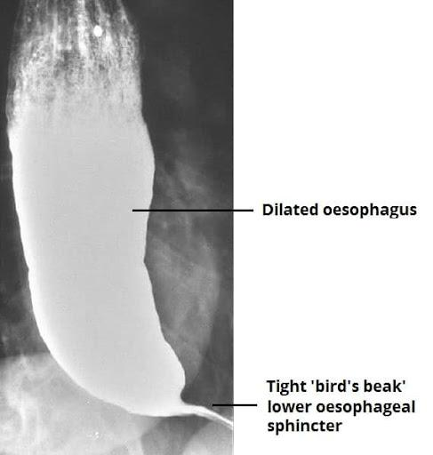

On x-ray the esophagus above is **dilated** and the lower esophageal sphincter is a tight **"bird's beak"** — that narrowing is the LES that won't relax.

- **Absent or ineffective peristalsis** — obstruction of the esophagus near the diaphragm, with tapering of the lower esophagus
- **Aperistaltic esophagus** — the muscles tighten up
- **LES pressure is increased too much → food won't go down**
- **S&S:** dysphagia with **solid** food, regurgitation, odynophagia, pyrosis, halitosis
- **Diagnosed with x-ray**
- **Teaching:** eat **slowly** and **drink fluids with meals**
- **Treatment:** dilation, or surgery if severe

### Esophageal spasm ★
- **Muscular spasm interrupting normal peristalsis**
- **S&S:** dysphagia, pyrosis, regurgitation, **chest pain**
- **Diagnosed with esophageal manometry**
- **Treated with muscle relaxants and proton pump inhibitors**

**Achalasia vs. esophageal spasm — the discriminators:** achalasia is *absent* peristalsis diagnosed by **x-ray**; spasm is *disorganized* peristalsis diagnosed by **manometry** and it presents with **chest pain**.

### Diverticulum ★

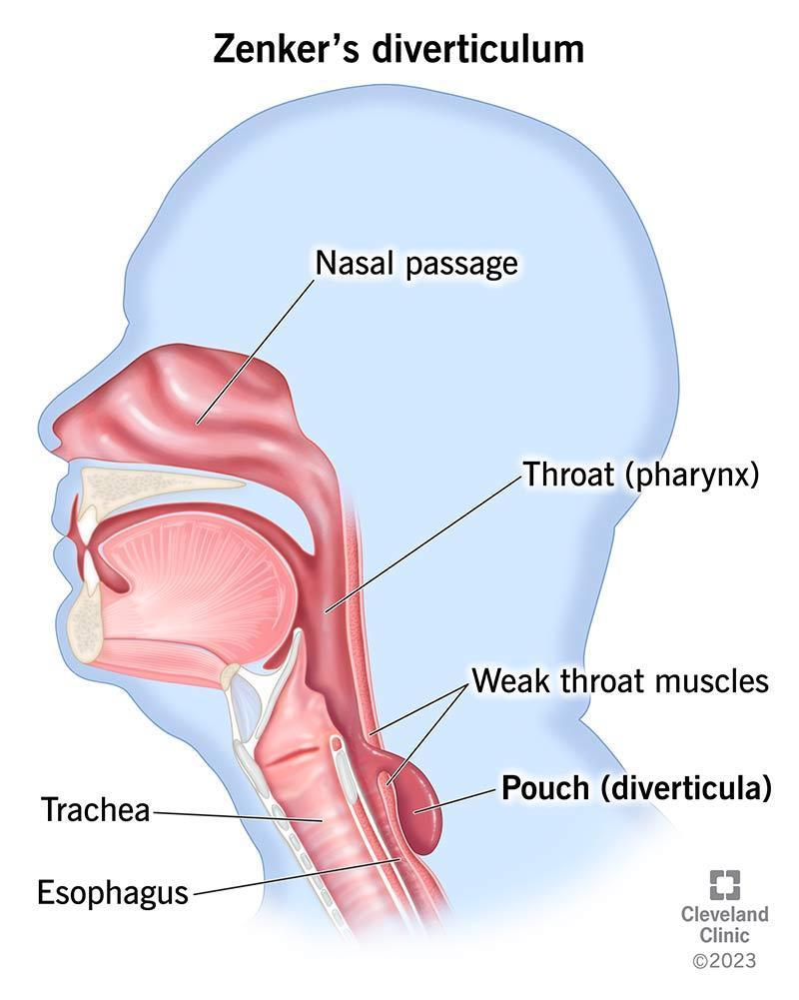

- **Outpouching of mucosa through the musculature**
- Most common is **Zenker diverticulum (ZD)**
- **S&S:** dysphagia, **fullness in the neck**, belching, regurgitation, **gurgling noises**, halitosis
- **Diagnosed with barium swallow or manometric studies**
- **★ AVOID NG TUBE INSERTION** — the tube can enter the pouch and perforate it
- **Cause (instructor note):** a dysfunctional sphincter fails to open, and the increased pressure pushes out the pouch

### Perforation ★
- **Excruciating retrosternal pain** and dysphagia
- **Life-threatening** — requires **immediate surgical intervention** and antibiotics
- **Diagnosed with x-ray, barium swallow, chest CT**
- **NPO post-op**

---

## HIATAL HERNIA

**Definition:** the opening for the esophagus (diaphragmatic hiatus) becomes **enlarged** and part of the stomach protrudes into the lower portion of the thorax.

### Two types
| | **Axial (sliding)** | **Paraesophageal** |
|---|---|---|
| What moves | The **gastroesophageal junction** and part of the stomach slide **in and out** through the weakened diaphragm | The **fundus** is displaced **upward**, with the greater curvature passing through the diaphragm **next to** the GE junction |
| Position of GE junction | Moves | Stays in place |

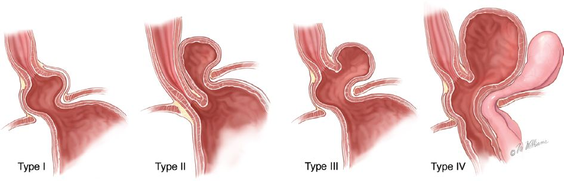

> ⚠ **Open question — worth asking her.** The slide shows an image labeled **Type I, II, III, and IV**, but no slide text anywhere defines four types. The only classification given in words is axial (sliding) vs. paraesophageal. If she expects the Roman numeral system, that content isn't in your materials. Ask before the exam.

### Assessment
- **Dysphagia, pyrosis, regurgitation, intermittent epigastric pain, fullness after eating, nausea/vomiting** — or **may be asymptomatic**
- Substernal or epigastric pressure/pain **after eating and when lying down**
- **Increased symptoms when bending at the waist**
- If scars form, swallowing becomes difficult; as food distends the esophagus the patient may vomit
- **Reflux does NOT usually accompany hernias**
- **Diagnosis:** x-ray, **barium swallow** (confirms), EGD, esophageal manometry, CT

### Medical management
- Treated **only if the patient is symptomatic** (for example, GERD)
- **Surgery** — usually laparoscopic

### Patient teaching ★ (MUST KNOW)
- **Frequent small meals**
- **Do not recline for 1 hour after eating**
- **Elevate the head of the bed (4–8 inches)**
- **If post-op, advance the diet slowly**

---

## GASTROESOPHAGEAL REFLUX DISEASE (GERD)

**Definition:** backflow of gastric or duodenal contents into the esophagus, causing troublesome symptoms and/or **mucosal injury** to the esophagus.

### Causes of excessive reflux
Incompetent **lower esophageal sphincter** · pyloric stenosis · hiatal hernia · a motility disorder

### Incidence and risk factors
- Incidence **increases with age**
- Associated with irritable bowel syndrome and **obstructive airway disorders** (asthma, COPD, cystic fibrosis)
- Associated with Barrett esophagus, peptic ulcer disease, angina
- **Other risk factors:** tobacco use, coffee drinking, alcohol consumption, gastric infection with ***H. pylori***
- Affects about **20%** of the population (instructor note)

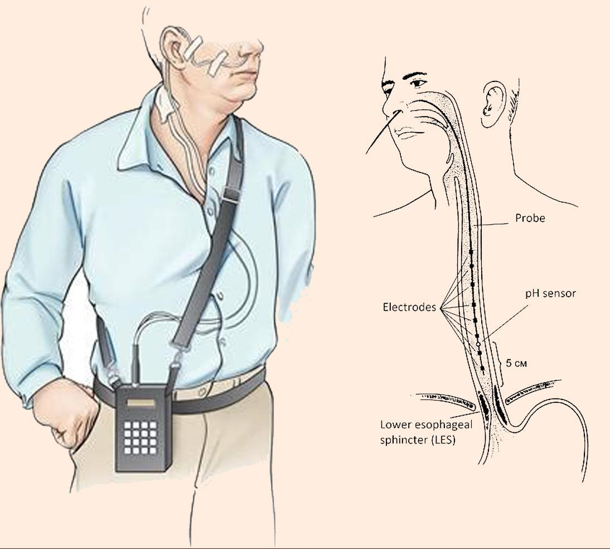

### Assessment
- **Pyrosis and regurgitation are the hallmark of GERD**
- Dyspepsia, dysphagia, hypersalivation, esophagitis
- **pH monitoring = gold standard for diagnosis**
- Endoscopy and barium swallow evaluate for **complications**

### Complications
Dental erosion · ulcerations in the pharynx/esophagus · laryngeal damage · **esophageal strictures** · **adenocarcinoma** · pulmonary complications

### Barrett esophagus ⊙
- **Altered mucosa** — the squamous lining of the esophagus is replaced by columnar epithelium
- Risk profile: **white men 50 and older, family history**
- **The only known precursor to esophageal adenocarcinoma** — usually caused by GERD
- Diagnosed on **biopsy** during endoscopy

### Teaching
- **Low-fat diet**
- Avoid **caffeine, tobacco, beer, milk, peppermint or spearmint, carbonated beverages**
- Avoid foods/beverages that **lower LES pressure**: alcohol, peppermint, **licorice**, caffeine, high-fat foods
- **Avoid eating or drinking 2 hours before bedtime** (addendum also states do not eat 2–3 hours before bed)
- **Elevate the head of the bed at least 30 degrees** (addendum: raise HOB 6–8 inches)
- **Sit upright 2–3 hours after meals**
- **Small frequent meals** · limit protein to normal amounts
- **Tobacco cessation** · limit alcohol · **maintain healthy weight / lose weight**

> **Note the conflicting numbers.** The GERD teaching slide says elevate HOB **at least 30 degrees**; the addendum says **6–8 inches**; the hiatal hernia slide says **4–8 inches**. Know all three as written rather than picking one.

### Medications for GERD (Addendum)
| Class | Drugs | Notes |
|---|---|---|
| **Histamine-2 receptor antagonists** (antisecretory) | Cimetidine (Tagamet), Famotidine (Pepcid), Ranitidine (Zantac), Nizatidine (Axid) | Reduce acid secretion |
| **Proton pump inhibitors** | Nexium, Prevacid | Block the acid pump |
| **Cytoprotective agents / acid protective** | **Sucralfate (Carafate)** | **Coats the stomach. Give before meals.** |

---

## GASTRITIS

**Definition:** disruption of the **mucosal barrier** that normally protects stomach tissue from digestive juices.

**Why that matters:** the stomach makes acid strong enough to digest tissue. The only reason it doesn't digest itself is the mucosal barrier. Break the barrier and the stomach starts injuring itself — that single mechanism explains gastritis, ulcers, and their complications.

### Acute vs. chronic

| | **ACUTE** | **CHRONIC** |
|---|---|---|
| Onset | **Rapid onset** of symptoms | **Prolonged** inflammation |
| Tissue change | — | **Atrophy of gastric tissue** |
| Most common cause | **Dietary indiscretion** | Benign or malignant **ulcers of the stomach**, or ***H. pylori*** |
| Course | **Self-limiting** — recovery in **1–3 days** | Ongoing |
| Other causes | Medications, alcohol, bile reflux, radiation therapy; ingestion of strong acid or alkali may cause serious complications | Autoimmune disease (Hashimoto, Addison, Graves), dietary factors, medications, alcohol, smoking, chronic reflux of pancreatic secretions or bile |

### Classification of acute gastritis
- **Erosive** — local irritants: **aspirin, NSAIDs, corticosteroids, alcohol, radiation**. Severe form caused by ingestion of strong acid or alkali.
- **Nonerosive** — ***H. pylori***. Can cause peptic ulcers.
- **Stress-related** — severe burns, infection, lack of perfusion, surgery
- **Complications:** perforation, scarring, **pyloric stenosis**, tissue atrophy, hemorrhage

### Manifestations ★ (MUST KNOW)

| | **ACUTE** | **CHRONIC** |
|---|---|---|
| Symptoms | Epigastric pain, dyspepsia, anorexia, **hiccups**, nausea, vomiting | Fatigue, pyrosis, belching, **sour taste in the mouth**, halitosis, **early satiety**, anorexia, nausea and vomiting |
| Bleeding | **Erosive gastritis** → melena, hematemesis, hematochezia | — |
| Anemia | — | **Pernicious anemia from B12 malabsorption** |
| Other | — | Some are **asymptomatic**; mild epigastric discomfort with intolerance of spicy or fatty food, **relieved by eating** |

- **Definitive diagnosis: endoscopy with histologic examination of a biopsy specimen**
- **Intrinsic factor** is produced by the **parietal cells** of the stomach and is necessary for **B12 absorption** → chronic gastritis atrophies those cells → no intrinsic factor → **pernicious anemia**

### Medical management ★ (must know)

**Acute**
- **Recovery in 1–3 days**
- **Refrain from alcohol and food until symptoms subside**
- **Supportive therapy:** IV fluids, **nasogastric intubation**, antacids, **histamine-2 receptor antagonists**, **proton pump inhibitors** (likely also an antibiotic if hospitalized)

**Chronic**
- **Modify diet, promote rest, reduce stress, avoid alcohol and NSAIDs**
- Pharmacologic therapy
- Treatment may include placement of an **NG tube, endoscopy, or surgery** (for perforation or hemorrhage)

### Nursing management ★ (must know)
- **Reduce anxiety** — calm approach, explain all procedures and treatments
- **Promote optimal nutrition** — for **acute** gastritis the patient takes **no food or fluids by mouth**; introduce **clear liquids** and then solid foods as prescribed. Evaluate and report symptoms. Discourage **caffeinated beverages, alcohol, cigarette smoking**. Refer for alcohol counseling and smoking cessation.
- **Promote fluid balance** — monitor I&O and watch for **dehydration, electrolyte imbalance, and hemorrhage**
- **Measures to relieve pain** — diet and medications
- **Monitor for signs and symptoms of GI bleed and shock**

---

## PEPTIC ULCER DISEASE (PUD)

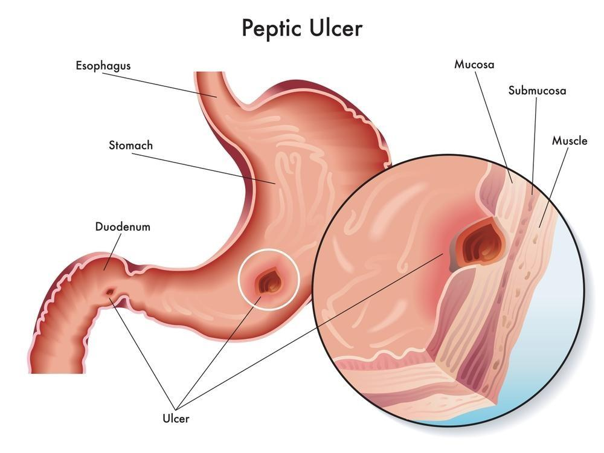

**Definition:** erosion of a mucous membrane forming an **excavation** in the stomach, pylorus, **duodenum (most common site)**, or esophagus.

> The professor wrote a Knowledge Check on this: the most common site is the **duodenum**, **not** the pylorus.

### Causes and risk factors
- **Most often caused by *H. pylori* infection**
- Less often a **stress ulcer** from burn, shock, sepsis, **MODS** (multi-organ dysfunction syndrome), TBI, mechanical ventilation — probably from **tissue ischemia**
- **Risk factors:** excessive secretion of stomach acid, dietary factors, **chronic NSAID use**, alcohol, smoking, familial tendency, **blood type O**, COPD, liver cirrhosis, chronic kidney disease, autoimmune disorders
- ⊙ Peak onset **30–60 years of age**; affects roughly 4.6 million Americans annually
- ⊙ Also associated with **Zollinger-Ellison syndrome (ZES)** — rare tumors in the pancreas and duodenum that drive **gastric hyperacidity and severe ulcer disease**

### Assessment

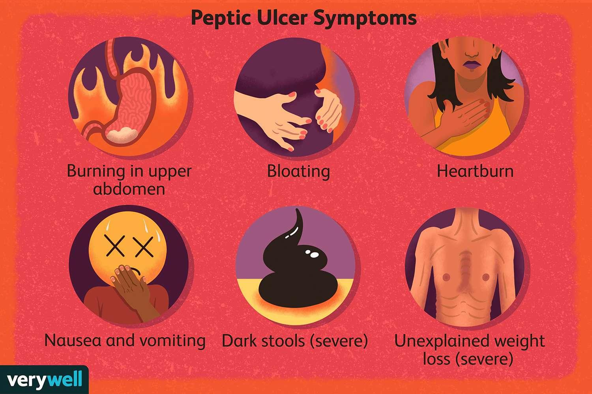

- May be **asymptomatic** — "silent peptic ulcer"
- **Dull gnawing pain or burning in the midepigastrium**
- **Sour eructation** (burping), heartburn
- **Vomiting** with **undigested food** in the emesis — and the vomiting **relieves the pain**

### Duodenal vs. gastric ulcer ★ (MUSTT KNOW)

| | **DUODENAL ULCER** | **GASTRIC ULCER** |
|---|---|---|
| Timing of pain | **2–3 hours AFTER eating** | **Within 30 minutes after eating** |
| Night pain | **Often wakes the patient at night** | Less typical |
| Effect of eating | **Eating RELIEVES symptoms** | Eating **triggers** pain |
| Frequency | **More common** | Less common |
| Perforation risk | ⊙ **More common** here | Less common |

**Why:** in a duodenal ulcer, food buffers acid in the stomach first, so eating helps and pain returns later once the stomach empties acid into the duodenum. In a gastric ulcer the lesion is in the stomach itself, so food arriving on the ulcer causes pain quickly.

### Signs of perforation
**Sudden onset of severe pain**, especially sharp upper abdominal pain **referred to the shoulder**, with **hypotension and tachycardia**.

### Diagnosis
Physical exam · **upper endoscopy with histologic exam** · **urea breath test**

### Treatment
- **Medications**, including **antibiotics if *H. pylori* is present**
- Lifestyle changes
- **Surgery occasionally, if wounds don't heal in 12–16 weeks**

### Teaching
- **Tobacco cessation** — ⊙ smoking raises gastric cancer risk by roughly 25%
- **Dietary modification:**
  - Avoid **extremes in temperature**, alcohol, coffee, caffeine
  - **Regular meals**

### Drug regimens ⊙ (brief)

| Indication | Regimen | Key point |
|---|---|---|
| **Ulcer healing — PPIs** | Esomeprazole, lansoprazole, omeprazole, pantoprazole, rabeprazole | **4–8 weeks** for complete healing; high-risk patients need a **maintenance dose for 1 year** |
| **Ulcer healing — H2 blockers** | Cimetidine, famotidine, nizatidine | **6–8 weeks** for complete healing |
| ***H. pylori* — quadruple therapy** | **Bismuth subsalicylate + tetracycline + metronidazole + a PPI**, 10–14 days | ~85% effective; four-times-daily dosing hurts adherence |
| ***H. pylori* — alternate** | Clarithromycin + amoxicillin + metronidazole + PPI, 10–14 days | |
| **NSAID ulcer prophylaxis** | PPI, or **misoprostol** | Misoprostol is **pregnancy category X** — softens the cervix, can cause miscarriage or premature labor |

> **The PPI duration is a confirmed Knowledge Check answer: 4–8 weeks.**

### Surgical management ⊙ (names only)
**Vagotomy** (cuts the vagus nerve to reduce acid stimulation), **pyloroplasty**, **antrectomy**, **gastrojejunostomy**, **gastrectomy**.

---

## COMPLICATIONS OF GASTRITIS AND PUD ⊕

The slide lists these four by name and stops. This is the content behind them.

### 1. Hemorrhage
- **Gastritis and hemorrhage from peptic ulcer are the two most common causes of upper GI bleeding**
- Presents as **hematemesis or melena**
- Vomited blood is **bright red**, or has a **dark "coffee grounds" appearance** from oxidation of hemoglobin to methemoglobin
- **Large hemorrhage (2,000–3,000 mL)** → most of the blood is **vomited**
- **Small hemorrhage** → most blood passes in the stool, appearing **tarry black** from digested hemoglobin
- Duodenal ulcer hemorrhage carries roughly **5% mortality**

**Nursing actions**
- Assess for **faintness, dizziness, and nausea** — these may **precede** the bleeding
- Monitor vital signs frequently for **tachycardia, hypotension, tachypnea**
- Monitor **hemoglobin and hematocrit**; test stool for gross or occult blood
- Record **hourly urine output** to detect oliguria or anuria
- Anticipate **NG tube insertion** — distinguishes fresh blood from coffee-ground material, allows saline lavage to remove clots and acid, decompresses the stomach, and provides a way to monitor ongoing bleeding
- Prepare for treatment of **hemorrhagic shock** — IV fluid resuscitation and blood component therapy

### 2. Perforation vs. penetration

| | **PERFORATION** | **PENETRATION** |
|---|---|---|
| What happens | Ulcer erodes **through the gastric serosa into the peritoneal cavity** | Ulcer erodes through the serosa into **adjacent structures** — pancreas, biliary tract, gastrohepatic omentum |
| Warning | **Occurs without warning** | Gradual |
| Hallmark symptom | **Sudden, severe, increasing upper abdominal pain**, referred to the shoulder (especially the **right shoulder**, from **phrenic nerve irritation**) | **Back and epigastric pain no longer relieved by medications that used to work** |
| Urgency | **Abdominal emergency — immediate surgery** | Usually requires surgery |
| More common with | **Duodenal ulcers** | — |

**Other signs of perforation:** vomiting · **collapse/fainting** · extremely tender, **rigid "boardlike" abdomen** · hypotension and tachycardia indicating **shock**

**Why speed matters:** **chemical peritonitis develops within hours** of perforation and is followed by **bacterial peritonitis** — so the perforation must be closed and the abdominal cavity lavaged as fast as possible. Can progress to sepsis or multiorgan failure.

**Post-op nursing:** stomach contents drained via **NG tube** · monitor **fluid and electrolyte balance** · assess for localized infection or peritonitis (**increased temperature, abdominal pain, paralytic ileus, increased or absent bowel sounds, abdominal distention**) · give antibiotics as prescribed

### 3. Gastric outlet obstruction
- Occurs when the area **distal to the pyloric sphincter** becomes **scarred and stenosed** — from spasm, edema, or scar tissue laid down as an ulcer repeatedly heals and breaks down
- PUD accounts for about **37% of benign** gastric outlet obstruction; **malignancy is the leading cause overall**
- **S&S:** nausea and vomiting, constipation, **epigastric fullness**, anorexia, and **later weight loss**

**Nursing actions**
- **Priority action: insert an NG tube to decompress the stomach**
- Confirm by measuring **aspirate volume — more than 400 mL suggests obstruction**
- Upper GI study or endoscopy confirms the diagnosis
- Decompression plus correction of **fluid volume and electrolyte balance** may avoid surgery
- **Balloon dilation of the pylorus** via endoscopy may help; if medical management fails, surgery (vagotomy with antrectomy, or gastrojejunostomy with vagotomy)

---

## NURSING PROCESS: GASTRITIS AND PEPTIC ULCER DISEASE

### Assessment
- **History** including presenting signs and symptoms
- **Dietary history** and dietary associations with symptoms — such as a **predictable time for pain**
- A **72-hour diet diary** may be helpful
- **Abdominal assessment** and **vital signs**
- **Medications — including NSAID use**
- Signs and symptoms of **anemia or bleeding**

### Goals
- **Relief of pain**
- **Reduced anxiety**
- **Maintenance of nutritional requirements**
- **Absence of complications**

### Interventions
- **Relieving pain** — ⊙ avoid **NSAIDs, especially aspirin**, and alcohol; eat meals at **regularly paced intervals in a relaxed setting**; relaxation techniques
- **Reducing anxiety** — ⊙ explain diagnostic tests, give medications on schedule, interact calmly, help identify stressors, teach coping and relaxation (biofeedback, hypnosis, behavior modification), involve family for emotional support
- **Maintaining optimal nutritional status** — ⊙ assess for malnutrition and weight loss; stress adherence to the medication regimen and dietary restrictions after the acute phase
- **Monitoring and managing potential complications** — hemorrhage, perforation and penetration, gastric outlet obstruction
- **Patient education**

### Complications to report ⊙
- **Hemorrhage** → cool skin, confusion, increased heart rate, labored breathing, blood in stool (bright red or tarry black)
- **Penetration and perforation** → severe abdominal pain, **rigid and tender abdomen**, vomiting, elevated temperature, increased heart rate
- **Gastric outlet obstruction** → nausea and vomiting, distended abdomen, abdominal pain

---

## DELIVERING NUTRITION ENTERALLY (Addendum + ⊕)

### Indication
Meet nutritional requirements when **oral intake is inadequate or not possible AND the GI tract is functioning.**

**The governing principle: if the gut works, use it.**

### Advantages over parenteral nutrition
- **Safe and cost effective**
- **Preserves GI integrity**
- Preserves the normal sequence of **intestinal and hepatic metabolism**
- Maintains **fat metabolism and lipoprotein synthesis**
- Maintains normal **insulin and glucagon ratios**
- ⊕ Better tolerated and easier to use at home or in extended care

### Tube selection
| Situation | Tube |
|---|---|
| Short-term, stomach accessible | **Nasogastric** |
| **Esophagus and stomach must be bypassed**, or **patient is at risk for aspiration** | **Nasoduodenal or nasojejunal** — NG is **NOT** used |
| Feeding indicated **longer than 4 weeks** | **Gastrostomy or jejunostomy** |

### Ongoing nursing responsibilities (addendum slide list)
Tube insertion · **confirming placement** · clearing tube obstruction · monitoring the patient · maintaining tube function · **oral and nasal care** · monitoring, preventing, and managing complications · **tube removal**

⊕ **Nasopharyngeal irritation** is a real mechanical complication — caused by tube position, improper taping, or use of a large-bore tube. **Assess the nasopharyngeal mucous membranes every 8 hours**, and tape the tube so it doesn't put pressure on the nares.

⊕ Patient education and preparation matter because **formula is selected based on patient needs** — chemical composition of the nutrient source, caloric density, osmolality, fiber content, vitamins, minerals, electrolytes, and cost. Enteral formulas are only **70–85% free water**, so they are **not designed to meet total fluid needs** on their own.

### Osmolality and dumping syndrome ⊕
- Normal body fluid osmolality ≈ **300 mOsm/kg**, and the body works to keep GI contents near that level
- A **high-osmolality formula** delivered **too fast or in too large a volume** pulls water rapidly **into the intestinal lumen** from surrounding fluid and the vascular compartment
- Result = **dumping syndrome** (also called **vagotomy syndrome**): **fullness, nausea, cramping, dizziness, diaphoresis, osmotic diarrhea**
- Can progress to **dehydration, hypotension, and tachycardia**
- **Prevention:** start at a **low hourly rate and advance slowly** so the small intestine can adapt

**Why:** this is osmosis. A concentrated solution in the gut lumen drags water out of the bloodstream to dilute it — so the patient loses circulating volume, which is why the blood pressure drops and the heart rate rises.

### Assessment of the patient receiving enteral feeding
- **Tube placement** and **patient position — head of bed elevated above 30 degrees**
- Ability to **tolerate the formula and amount** — watch for fullness, bloating, distention, nausea, vomiting, stool pattern
- **Clinical response** — ⊕ BUN, serum protein, prealbumin, electrolytes, kidney function, H&H
- **Signs of dehydration** — dry mucous membranes, thirst, decreased urine output
- **Elevated blood glucose, decreased urinary output, sudden weight gain, periorbital or dependent edema**
- **Signs of infection** — ⊕ replace open-system formula every **4–8 hours**; change container and tubing every **24 hours**
- **Check gastric residual volume**
- **I&O, weekly weights, dietitian consult**

### Maintaining tube function ⊕
- Flush with **at least 30 mL of water**: before and after intermittent feeding · before and after medication administration · after checking residuals · **every 4 hours with continuous feedings** · whenever the feeding is stopped or interrupted
- **Water used for flushes counts as intake** and must be recorded
- **Medications:** pause the feeding, flush with **15 mL before and 15 mL after**, and give each medication **separately** with a 15 mL flush between. Never mix medications into the formula.

### Key complications of enteral therapy ⊕

| Complication | Cause | Prevention |
|---|---|---|
| **Aspiration pneumonia** | Improper tube placement, vomiting, lying flat | **Keep HOB elevated 30 degrees**; verify placement reliably |
| **Diarrhea** | Hyperosmolar formula, rapid/bolus infusion, cold formula, antibiotics | Correct rate and formula temperature |
| **Tube obstruction** | Inadequate flushing, poorly crushed medications | Flush adequately; use liquid medications when possible |
| **Dehydration** | Hyperosmolar feeding with insufficient fluid | Adequate hydration through flushes |
| **Hyperglycemia** | Glucose intolerance, high-carbohydrate formula | Monitor blood glucose routinely |
| **Constipation** | Lack of fiber, inadequate fluid, opioids | Check fiber and water content |

---

## APPENDIX — IN THE TEXTBOOK, NOT LECTURED

Chapters 39, 40, and 41 contain these sections, none of which appear on any slide. Recorded here as one-liners only, so that if she mentions one in class it can be promoted into the guide quickly.

**Oral pathology (Chapter 40)**
- **Abnormalities of the lips, mouth, and gums** — including **leukoplakia** (white patch) and **erythroplakia** (red velvety patch, higher malignant potential)
- **Temporomandibular disorders (TMJ)** and jaw disorders requiring surgical management
- **Salivary gland disorders** — **parotitis** (inflammation of the parotid gland), **sialadenitis** (salivary gland inflammation), **sialolithiasis** (salivary stones), neoplasms
- **Cancer of the oral cavity and pharynx** — full pathophysiology, management, and nursing process
- **Neck dissection** — full nursing process, including airway clearance, wound care, and communication after surgery

**Gastric and esophageal malignancy**
- **Gastric cancer** — roughly 27,000 US diagnoses per year; mean age 68; higher incidence in males and in Hispanic, Black, and Asian/Pacific Islander Americans. Risk factors include ***H. pylori*** (major), diets high in smoked/salted/pickled foods and low in fruits and vegetables, alcohol, gastritis, pernicious anemia, smoking, obesity, prior partial gastrectomy, and genetics.
- **Esophageal cancer and esophagectomy** — including dumping syndrome as a post-esophagectomy complication
- **Hereditary diffuse gastric cancer** and **Lynch syndrome** (hereditary non-polyposis colorectal cancer)

**Other**
- **Genetics in nursing practice** for GI disorders
- **Percutaneous endoscopic gastrostomy (PEG) and endoscopic jejunostomy** — full nursing process
- **Enteral feeding delivery systems** — open vs. closed systems, hang times, enteral pumps
- **Transcatheter arterial embolization (TAE)** for uncontrolled ulcer bleeding
- **Refeeding syndrome** as a metabolic complication of enteral therapy

---

## STILL TO COME — UNIT 1

This guide covers **Lecture 1** only. The unit continues with:
- **Lecture 2** — Hepatic
- **Lecture 3** — Biliary, alternative nutrition
- **Lecture 4** — Colon
- **Lecture 5** — Alternative elimination
